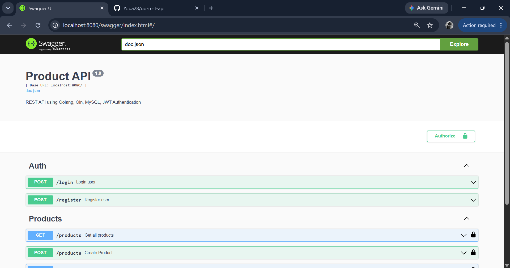

# Go REST API


REST API built with Golang, Gin Framework, MySQL, JWT Authentication, Role-Based Access Control (RBAC), Pagination, Search, Sorting, and Swagger Documentation.

## Swagger Preview



## Features

- User Registration
- User Login
- JWT Authentication
- Role-Based Access Control (Admin/User)
- Product CRUD
- Pagination
- Search Products
- Sorting Products
- Swagger API Documentation
- MySQL Database
- Environment Variables (.env)

## Tech Stack

- Golang
- Gin Framework
- MySQL
- JWT
- bcrypt
- Swagger
- godotenv

## API Documentation Preview

## Installation

Clone repository:

```bash
git clone https://github.com/USERNAME/go-rest-api.git
cd go-rest-api
```

Install dependencies:

```bash
go mod tidy
```

Create .env file:

```env
DB_USER=root
DB_PASSWORD=password
DB_HOST=localhost
DB_PORT=3306
DB_NAME=go_rest_api

JWT_SECRET=your_secret_key
```

Run application:

```bash
go run main.go
```

## API Documentation

Swagger:

```text
http://localhost:8080/swagger/index.html
```

## Authentication

Login:

```http
POST /login
```

Example:

```json
{
  "email": "admin@example.com",
  "password": "password123"
}
```

Response:

```json
{
  "token": "jwt_token_here"
}
```

## Role Permissions

### User

- GET /products
- GET /products/{id}

### Admin

- POST /products
- PUT /products/{id}
- DELETE /products/{id}

## Product Query Parameters

Example:

```http
GET /products?page=1&limit=10&search=phone&sort=price&order=desc
```

Parameters:

| Parameter | Description            |
| --------- | ---------------------- |
| page      | Page number            |
| limit     | Items per page         |
| search    | Search by product name |
| sort      | id, name, price, stock |
| order     | asc, desc              |

## Project Structure

```text
go-rest-api/
├── config/
├── docs/
├── handlers/
├── middlewares/
├── models/
├── repositories/
├── routes/
├── .env
├── main.go
└── README.md
```

## Author

Yopa28
